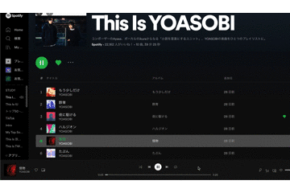
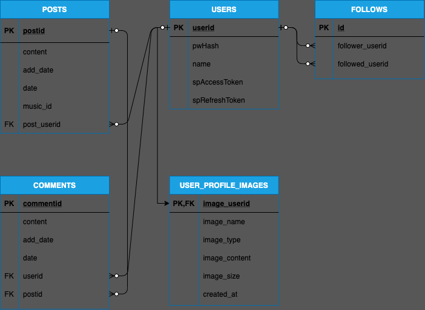

# Mushe
曲をシェアするためのSNSサイトです。
# サイト概要
簡単に音楽をシェアができるSNSです。

私自身が音楽を聴くのが好きなので、友達通しで好きな音楽や最近聴いている曲を共有できたらいいなと思いから作成しました。
# 個人的に凝った機能
## NowPlaying ($なうぷれ)
- 投稿時に現在再生中の曲を投稿する時に投稿文の最初に$なうぷれと入力するとSpotifyで現在再生中の曲を自動的取得して投稿に埋め込むことができます。 

# 使用技術
- 言語
  - PHP 7.4.14
- ライブラリ
  - [Spotify Web API PHP](https://github.com/jwilsson/spotify-web-api-php) 4.3.0
- 開発環境
  - Docker 20.10.6 / docker-compose 1.29.1
  - mysql 8.0.24 / phpmyadmin
  - macOS Big Sur 11.4
  - Visual Studio Code
- 本番環境
  - VPS CentOS Stream release 8
  - Docker 20.10.7 / docker-compose 1.16.1
  - mysql 8.0.24
- バージョン管理
  - Git 2.29.0

# 機能一覧
- ユーザー登録関連
  - 新規登録 プロフィール編集
    - 名前 プロフィール画像 パスワード変更
  - ログイン ログアウト機能
  - ゲストログイン機能
    - 閲覧用 投稿やコメントはできません。
- 投稿機能
  - 一覧表示、投稿詳細表示、投稿、編集、削除機能
- 検索機能
  - 投稿 ユーザー
- コメント機能
- フォロー機能
- API関連
    - Spotify API
# DB設計

## 各テーブルの詳細
| テーブル名 | 説明 |
| :-: | :-: |
| USERS | ユーザー情報 |
| FOLLOWS | フォロー情報 |
| USER_PROFILE_IMAGES | ユーザーのプロフィール画像 |
| POSTS | 投稿情報 |
| COMMENTS | 投稿へのコメント情報 |
# セキュリティ
- XSS
  - テキスト表示時エスケープ処理
- CSRF
  - トークンを利用して正しいリクエストであるかどうかチェック
- SQLインジェクション
  - sql呼び出し時、プレースホルダを使用
# 最後に
PHPではなく、フレームワークのLaravelを使用したいのと、SPA形式にしたいのでVue.jsの導入もしていきたいです。 
今回は、本番環境をVPSのサーバーを借りてやりましたが、次回新しいものを作成する際は、AWSにも挑戦していきたいなと思いました。
